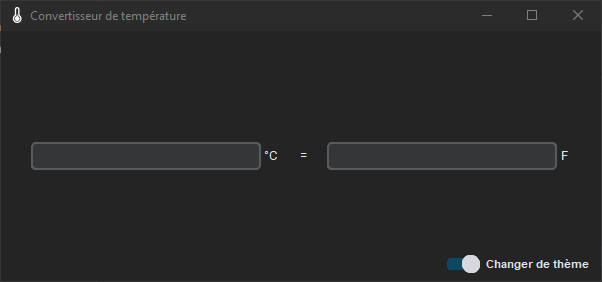
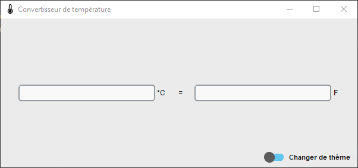

# Temperature Conversion Application

An application developed with Python, using the Tkinter library for the GUI management.

The application theme automatically follows the system theme, but can also be changed with a toggle button.

*Dark theme*

*Light theme*

## Presentation

The application supports conversion between **Farhenheit** and **degrees Celsius** values.\
The conversion management is dynamic : you can modify one field and it automatically updates the other field.\
You can also navigates through the fields with Tab and the keyboard arrows.

## Dependencies

- **Python >= 3.7**
- **CustomTkinter** is a python UI-library based on Tkinter, with more modern and fully customizable widgets.\
The window and most of the widgets in the script are customtkinter objects.
- **Pillow** (PIL fork, Python Imaging Library) is used to manage images.

If you don't have Python installed, you can download the executable of the application in the [release]().